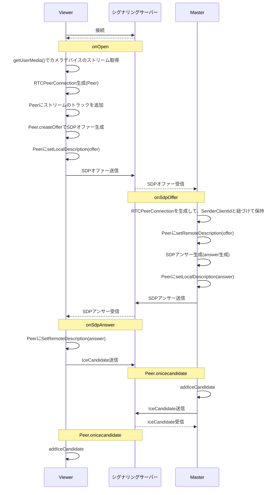

# Amazon KinesisVideoStreamを使ったWebRTCのサンプルアプリケーション

# シーケンス

```mermaid
sequenceDiagram
  participant Viewer
  participant シグナリングサーバー
  participant Master

  Viewer->>シグナリングサーバー: 接続
  シグナリングサーバー-->>Viewer: 
  Note over Viewer,シグナリングサーバー: onOpen
  Viewer->>Viewer: getUserMedia()でカメラデバイスのストリーム取得
  Viewer->>Viewer: RTCPeerConnection生成(Peer)
  Viewer->>Viewer: Peerにストリームのトラックを追加
  Viewer->>Viewer: Peer.createOfferでSDPオファー生成
  Viewer->>Viewer: PeerにsetLocalDescription(offer)
  Viewer->>シグナリングサーバー: SDPオファー送信
  シグナリングサーバー-->>Master: SDPオファー受信
  Note over シグナリングサーバー,Master: onSdpOffer
  Master->>Master: RTCPeerConnectionを生成して、SenderClientIdと紐づけて保持
  Master->>Master: PeerにsetRemoteDescription(offer)
  Master->>Master: SDPアンサー生成(answer生成)
  Master->>Master: PeerにsetLocalDescription(answer)
  Master->>シグナリングサーバー: SDPアンサー送信
  シグナリングサーバー-->>Viewer: SDPアンサー受信
  Note over Viewer,シグナリングサーバー: onSdpAnswer
  Viewer->>Viewer: PeerにSetRemoteDescription(answer)
  Viewer->>シグナリングサーバー: IceCandidate送信
  Note over シグナリングサーバー,Master: Peer.onicecandidate
  Master->>Master: addIceCandidate
  Master->>シグナリングサーバー: IceCandidate送信
  シグナリングサーバー-->>Master: IceCandidate受信
  Note over Viewer,シグナリングサーバー: Peer.onicecandidate
  Viewer->>Viewer: addIceCandidate
```
